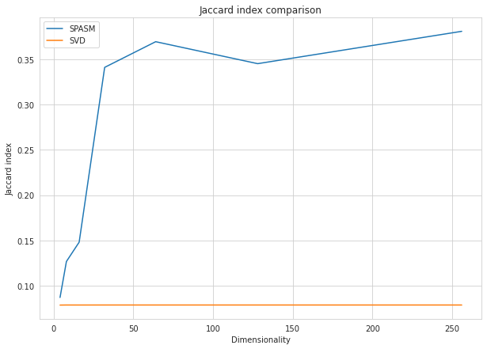

# NLA2022 Final Project, Team Achilles
The repository for final project at [NLA course](https://github.com/oseledets/nla2022) at Skoltech - "A connection between sparse and low-rank matrices and its application to manifold learning".

Sparse nonnegative matrix S can be recovered from a real-valued matrix L of significantly lower rank. Of particular interest is the setting where the positive elements of S encode the similarities of nearby points on a low dimensional manifold, and it can be implemented by a neural network with one layer of rectified linear units, so it suggests many possibilities for high dimensional data analysis, especially for data that is naturally represented as a sparse nonnegative matrix. In this project we implement an algorithm for the problem based on the nonlinear low-rank decomposition of sparse matrices.

Main results of the work:
- Explored a geometrical connection between sparse and low-rank matrices.
- The algorithms for Sparse similarity matching and Locally linear extension were implemented from scratch.
- On MNIST dataset the algorithm discovers much lower dimensional representations which preserve meanings.

The experiments can be repeated by sequentially running the code in `nla_project.ipynb`. All the instructions are given in the same file.

Requirements:
- tensorflow >= 2.9.2
- matplotlib >= 3.2.2
- seaborn >= 0.11.2
- numpy >= 1.21.6
